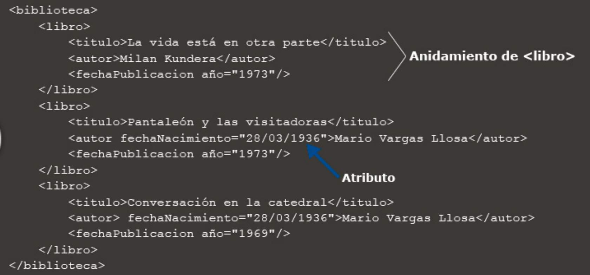

# eXtensible Markup Language (XML)

## Introducción

Si bien HTML está concebido para presentar la información, XML se limita a crear estructuras básicas de textos para facilitar su comprensión por el ser humano o para que seán procesadas por los sistemás informáticos. Uno de los objetivos principales de XML es almacenar la información de forma estructurada o incluso para transmitirla.

XML nos va a ayudar mucho dentro de la programación, como por ejemplo:

1. Crear documentos XML que seran leidos por programas, como ficheros de propiedades o ficheros de configuración. Se usan ficheros XML para dar información adicional sobre la configuración del programa. 

2. Intercambio de información entre sistemas informáticos o programas. Suele ser un formato de intercambio de información estandar.

XML entra dentro del concepto de **metalenguaje**, es decir, es un conjunto de reglas para formar documentos de etiquetas.

## Caracteristicas

1. Su principal característica es que XML no está predefinido, por lo que debes definir tus propias etiquetas.

2. La información que está dentro de un XML está estructurada, lo que facilita el procesamiento por programas informáticos.

3. XML no es un lenguaje de programación, ya que no posee estructuras de control.

4. XML es un <b>metalenguaje</b>, es decir, a partir del mismo podemos construir otros lenguajes como XHTML, RSS o SVG.

5. Podemos definir reglas de validación, mediante DTD o XSD.

6. XML se almacena en formato de texto plano.

7. Es de código abierto (www.w3c.org).

Ejemplo de XML

## Tipos de nodos en XML

1. **Etiquetas o elementos**. Son las partes en las que se divide el documento. Crean una estructura jerárquica en forma de arbol, en la que etiquetas contienen otras etiquetas. Una etiqueta puede tener varias etiquetas hijas, pero una etiqueta solo puede tener una etiqueta padre.

2. **Atributos**. Son características de una etiqueta, pertenecen a la propia etiqueta que lo
contiene.

3. **Comentarios**. Los comentarios son elementos que no son ni contenido ni ningún elemento de marcado. Permiten hacer anotaciones para que sea más legible y entendible el documento XML. Un comentario no puede estar dentro de una etiqueta.

        <!-- Esto es un ejemplo de comentario y no tendrá repercusión cuando se procese el documento. -->

4. **Referencias de entidad**. Se utilizan para escribir en el contenido del documento caracteres
que son difíciles de escribir o no están en el teclado. Para ello se utilizan 3 formas:

    - Por el nombre de entidad. Siempre debe empezar con **&** y terminar con el punto y coma. La forma de escribirlo sería '&nombre_entidad;'
            
                Ej: &acute; = á
                Ej: &lt; = < 

    - Por el nombre decimal. Funciona de forma similar al anterior, pero en lugar de indicar el nombre del carácter se introduce su codificación en ASCII. La forma de escribirlo sería '&#numero;'

            Ej: &#163; (al procesar pondria el simbolo de la libra)

    - Por el valor hexadecimal. Funciona de forma similar, pero aquí se indica el número en formato hexadecimal. La forma de escribirlo sería '&#xnumero;'

5. **Texto**. Un nodo texto representa el contenido de una etiqueta (y que no sea otra etiqueta).

6. **CDATA**. Identifican una sección en la que no se interpretarán los caracteres. Se utiliza para poder mostrar caracteres en el documento procesado que son expresiones o palabras reservadas en XML.

    El formato para escribir una sección CDATA es:

        <! [CDATA[ CARACTERES NO PROCESADOS]]>

7. **Instrucciones de procesamiento**. Son etiquetas que proporcionan información, datos o instrucciones a una aplicación. Cuando se utiliza el documento estas instrucciones serán interpretadas por la aplicación que procesa el XML. Al igual que los comentarios, no forman parte de la presentación de XML.

    Para escribir una instrucción de procesamiento se utiliza la siguiente forma:

            <? Nombre instrucción ?>

8. **DTD** (Declaraciones de tipo de documento). Sirven para la descripción de la estructura y la sintaxis del documento. Las veremos con mas detalle en otros temas.

## Sintaxix XML

XML es un lenguaje de marcado; esto quiere decir que cada paquete de información está delimitado por dos etiquetas, como se hace también en el lenguaje HTML.

    <nombre>Julia</nombre>

La etiqueta "nombre" identifica la palabra Julia como un nombre de persona, XML se centra en el significado del texto que encierra su etiqueta y no en la apariencia de cómo se muestre el texto. Recordemos que el objetivo es almacenar información.

## Documentos bien formados

Un documento bien formado es aquel que **cumple con las reglas de XML** y por lo tanto puede ser procesado como tal. Las reglas serían las siguientes:

1. Solo puede existir un elemento raíz, que será el padre de los demás.

2. Los elementos deben seguir una estructura jerárquica. Cada elemento debe estar contenido dentro de otro.

3. Los elementos no pueden estar superpuestos. Un elemento que está contenido en otro elemento debe contener dentro de este elemento su etiqueta de inicio y final.

4. Los elementos deben estar cerrados, es decir, todos los elementos deben contener su etiqueta de inicio y de cierre. Si un elemento no tiene contenido se puedo autocerrar

        Ej: Cierre normal: <elemento1></elemento1>
        Ej: Autocierre: <elemento/>

5. El nombre de los elementos debe empezar siempre con un carácter no numérico y nunca puede comenzar por XML o cualquier variación, es decir, no puede empezar por xml, Xml, XMl, xML, etc.

6. Hay que respetar las mayúsculas y minúsculas. XML es un lenguaje case sensitive (sensible a mayúsculas y minúsculas). 

        No es lo mismo la etiqueta <EtiQueta> que la etiqueta <eTiqueTa>.

7. Los espacios y retornos de carro solamente son tenidos en cuenta si aparecen en el valor de un atributo.

8. No se pueden utilizar de "manera normal" los caracteres y palabras claves de XML, que son: &, <>,"". Habria que utilizar entidades que representen dichos caracteres.

9. Los elementos no admiten espacios en blanco. Mejor utilizar un 'snake case'

## Documento válido

Un documento XML es válido si **está bien formado y además se ajusta a una estructura definida**. Dicha estructura la podemos definir en documentos DTD o XSD. La validación de documentos XML la veremos los siguientes temas.

## Bibliografía

- <https://www.w3schools.com/xml/>
- <https://www.mclibre.org/consultar/xml/>
- <https://desarrolloweb.com/manuales/18/>
- <https://developer.mozilla.org/es/docs/Web/XML/XML_introduction>
- <https://www.w3.org/XML/>

### Validadores online

- <http://www.w3schools.com/xml/xml_validator.asp>
- <http://www.xmlvalidation.com> 

