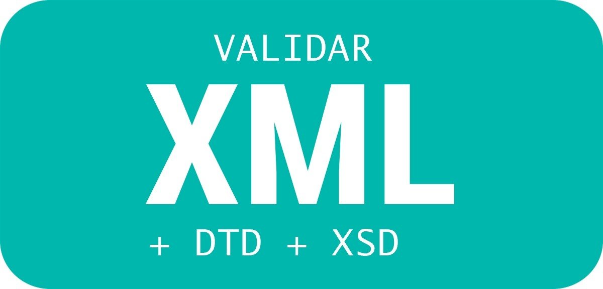

# XML Schema Definition (XSD)

## Introducción

**XSD** (XML Schema Definition) es un lenguaje de esquema utilizado para describir la estructura y las restricciones de los contenidos de los documentos XML de una forma muy precisa, más allá de las normas sintácticas impuestas por el propio lenguaje XML.

Tanto DTD como XSD proporcionan **validación** de documentos XML, pero XSD es más potente que el DTD clásico de XML, ya que permite más flexibilidad. XSD es un estándar recomendado por la **W3C**.

Un XSD o esquema, al contrario que un DTD, puede definir tipos de datos, lo cual es claramente beneficioso en el intercambio de datos, objetos o bases de datos.

En la actualidad los XSD se utilizan en mayor medida que los DTD para validar XML, ya que son más potentes y además siguen la gramática XML. Por contra, XSD puede llegar a ser más complicado que DTD ya que tiene más reglas.

La idea de este documento es ver las reglas más importantes que debemos saber para trabajar con XSD.

## XSD vs DTD

Principales diferencias:

   1. XSD permite utilizar tipos de datos. Mientras que con DTD el tipo de datos siempre era texto, con XSD podemos afinar más y decir que puede ser numérico, cadenas, etc.
   2. Los XSD pueden implantar reglas mucho más específicas que los DTD sobre el contenido de los elementos y atributos. Son las llamadas restricciones. Por ejemplo, que el texto de una etiqueta "nombre" no pueda exceder de 20 caracteres.
   3. En XSD no se pueden describir **entidades**. Necesitaremos utilizar DTDs para ello.

## Definición

XSD es un lenguaje basado en XML, a diferencia de los DTDs. Un XSD siempre lo pondremos en un fichero con extensión **.xsd** y empieza con la etiqueta **xs:schema**.

Al definir el schema es necesario escribir una serie de atributos. El primero es el **namespace** al que pertenece nuestro esquema o XSD (http://www.w3.org/2001/XMLSchema) y asignarle un nombre (xs).

    <xs:schema xmlns:xs="http://www.w3.org/2001/XMLSchema">

    </xs:schema>

Esto indica que los elementos utilizados corresponden al espacio de nombres (namespace) definido en esa dirección. Podemos decir que para que no haya ambigüedad entre las etiquetas descritas dentro del mismo documento, podemos definir un espacio de nombres al que pertenecen. Dentro de un espacio de nombres no puede haber dos etiquetas con el mismo nombre. En este caso estamos diciendo que las etiquetas que comiencen por **xs** pertenecen al espacio de nombres **http://www.w3.org/2001/XMLSchema**. Un XSD siempre pertenecerá al espacio de nombres **http://www.w3.org/2001/XMLSchema** pero no todos los XMLs tiene porque usar el mismo espacio de nombres.

Por poner una similitud, dentro de la programación, el namespace sería como los paquetes. Dentro de los sistemas informáticos, los namespaces serían como los directorios.

Existen diversas maneras de vincular un XML a un XSD, una de las más sencillas es poniendo las siguientes sentencias en el **nodo raíz del documento XML**

    xmlns:xsi="http://www.w3.org/2001/XMLSchema-instance"
    xsi:noNamespaceSchemaLocation= "DIRECCION_XSD"

## Elementos Simples

Los elementos simples pueden contener cualquier tipo de dato, pero no pueden tener atributos ni otros elementos hijos.

    <xs:element name="NOMBRE_DE_LA_ETIQUETA" type="xs:TIPO_DE_DATO"/> 

Siendo el atributo **name** el nombre de la etiqueta y el **type** el tipo de dato de la etiqueta. 

### Tipos de datos

Algunos de los tipos de datos más importantes son los siguientes:

1. **string** = cadena de texto; "Brasil"
2. **boolean** = valores booleanos; true / false
3. **byte, short, integer, long** = números enteros, varía el rango; -7, 0, 12.
4. **float, double, decimal** = números decimales; -47,1, 1766,86
5. **date** = fecha en formato AAAA-MM-DD; 1999-11-23
6. **time** = hora en formato HH:MM; 23:03

**Importante**, Se debe de poner el nombre del namespace que estamos usando delante del tipo de dato, por ejemplo, **xs:integer** o **xs:string**

Ejemplo práctico de un persona:

    <?xml version="1.0"?>
    <xs:schema xmlns:xs="http://www.w3.org/2001/XMLSchema">
        <xs:element name="persona">
            <xs:complexType>
                <xs:sequence>
                    <xs:element name="nombre" type="xs:string"/> 
                    <xs:element name="edad" type="xs:integer"/> 
                    <xs:element name="peso" type="xs:double"/> 
                    <xs:element name="casado" type="xs:boolean"/> 
                    <xs:element name="fecha_nacimiento" type="xs:date"/> 
                </xs:sequence>
            </xs:complexType>
        </xs:element>
    </xs:schema>

## Definir un namespace sin nombre

Si en la definición del XSD no incluimos un nombre al namespace (quitamos la parte de **xs**), no tenemos que poner el nombre al principio de todas las etiquetas. Es decir, si definimos el namespace de la siguiente manera:

    xmlns="http://www.w3.org/2001/XMLSchema"

Podemos hacer nuestro XSD sin poner **xs** al principio de cada etiqueta:

    <?xml version="1.0"?>
    <schema xmlns="http://www.w3.org/2001/XMLSchema">
        <element name="persona">
            <complexType>
                <sequence>
                    <element name="nombre" type="string"/> 
                    <element name="edad" type="integer"/> 
                    <element name="peso" type="double"/> 
                    <element name="casado" type="boolean"/> 
                    <element name="fecha_nacimiento" type="date"/> 
                </sequence>
            </complexType>
        </element>
    </schema>

Este ejemplo lo podemos ver en **01_XSD_Persona** junto con un atributo obligatorio.

## Elementos Complejos

Para añadir más elementos a un esquema vamos a utilizar la etiqueta **complexType** dentro de la etiqueta **element**. Todos los elementos irán entre esas etiquetas, indicando que hay un grupo de elementos o un único elemento con atributos.

Luego dentro de la etiqueta **complexType** normalmente va una de las siguientes tres etiquetas:

1. **sequence** han de incluirse todos los elementos que haya dentro respetando el orden. Normalmente es la más usada e importante de las tres.
2. **choice** Es necesario incluir uno de los elementos que haya dentro.
3. **all** han de incluirse todos los elementos que haya dentro, sin importar el orden.

Ejemplos:

    <?xml version="1.0"?>
    <xs:schema xmlns:xs="http://www.w3.org/2001/XMLSchema"> 
        <xs:element name="pelicula">  
            <xs:complexType>
                <xs:sequence>  
                    <xs:element name="titulo" type="xs:string" />
                    <xs:element name="minutos" type="xs:integer" />
                    <xs:element name="fecha_estreno" type="xs:date" />
                </xs:sequence>
            </xs:complexType>
        </xs:element>
    </xs:schema>

    <?xml version="1.0"?>
    <xs:schema xmlns:xs="http://www.w3.org/2001/XMLSchema"> 
        <xs:element name="pelicula">  
            <xs:complexType>
                <xs:choice>    
                    <xs:element name="titulo" type="xs:string" />
                    <xs:element name="minutos" type="xs:integer" />
                    <xs:element name="fecha_estreno" type="xs:date" />
                </xs:choice>
            </xs:complexType>
        </xs:element>
    </xs:schema>

    <?xml version="1.0"?>
    <xs:schema xmlns:xs="http://www.w3.org/2001/XMLSchema"> 
        <xs:element name="pelicula">  
            <xs:complexType>
                <xs:all>   
                    <xs:element name="titulo" type="xs:string" />
                    <xs:element name="minutos" type="xs:integer" />
                    <xs:element name="fecha_estreno" type="xs:date" />
                </xs:all>
            </xs:complexType>
        </xs:element>
    </xs:schema>

En el primer ejemplo tienen que ir los tres elementos, y en ese orden establecido.
En el segundo ejemplo solo pueden ir uno de esos tres elementos.
En el tercer ejemplo tienen que ir todos los elementos, pero en el orden que se quieran.

## Cardinalidad de los elementos

Para documentos XML en los que necesitemos definir elementos que se repitan, podremos utilizar los atributos **maxOccurs y minOccurs** dentro de la etiqueta **element**. Tienen las siguientes características:

1. Son atributos opcionales.
2. Estos dos atributos indican el mínimo (minOccurs) y máximo (maxOccurs) número de ocurrencias del elemento.
3. El valor por defecto para ambos atributos es 1.
4. Si se quiere indicar que el elemento puede aparecer un número ilimitado de veces, el atributo **maxOccurs** tomará el valor **unbounded**

Ejemplo:

    <?xml version="1.0"?>
    <xs:schema  xmlns:xs="http://www.w3.org/2001/XMLSchema"> 
        <xs:element name="persona">  
            <xs:complexType>
                <xs:sequence>  
                    <xs:element name="nombre" type="xs:string" minOccurs="1" maxOccurs="3"/>
                    <xs:element name="apellido" type="xs:integer" minOccurs="2" maxOccurs="unbounded"/>
                    <xs:element name="fecha_nacimiento" type="xs:date"/>
                    <xs:element name="direccion" type="xs:string" minOccurs="0"/>
                </xs:sequence>
            </xs:complexType>
        </xs:element>
    </xs:schema>

Nota: Si ponemos a un elemento **minOccurs="0"**, lo estamos haciendo optativo.

## Atributos

Para definir atributos se utiliza una sintaxis similar a la que tenemos para los elementos, pero con la etiqueta **attribute**.

   <attribute name="NOMBRE_ATRIBUTO" type="TIPO_ATRIBUTO"></attribute>

Características de los atributos:

   1. Siempre van dentro de la etiqueta **complexType** del elemento al que queremos que pertenezca el atributo y **AL FINAL** de la misma.
   2. Son optativos por defecto. Los podemos hacer obligatorios con el atributo **use="required"**.
   3. Se pueden poner valores por defecto con el atributo **default="valor"**.
   4. Se pueden poner valores fijados (solo puede tener un determinado valor) con el atributo **fixed="Valor"**.

Ejemplo:

    <?xml version="1.0"?>
    <xs:schema  xmlns:xs="http://www.w3.org/2001/XMLSchema"> 
        <xs:element name="persona">  
            <xs:complexType>
                <xs:sequence>  
                    <xs:element name="nombre" type="xs:string" minOccurs="1" maxOccurs="3"/>
                    <xs:element name="apellido" type="xs:integer" minOccurs="2" maxOccurs="unbounded"/>
                    <xs:element name="fecha_nacimiento" type="xs:date"/>
                    <xs:element name="direccion" type="xs:string" minOccurs="0"/>
                </xs:sequence>
                <attribute name="id" type="xs:integer" use="required" default="1"></attribute>
            </xs:complexType>
        </xs:element>
    </xs:schema>

Ver **02_XSD_Pelicula** para un ejemplo más completo de elementos y atributos.

## Etiqueta annotation

A menudo podemos incluir una descripción en nuestros esquemas como referencia y ayuda para quiénes los vaya a utilizar y para nosotros en un futuro. Para ello se utilizarán las etiquetas **xs:documentation** dentro de la etiqueta **xs:annotation**. Suele ir justo después de la etiqueta **xs:schema**

    <xs:annotation>
        <xs:documentation>
            Esto es una prueba de anotación dentro de un esquema
        </xs:documentation>
    </xs:annotation>

En el ejemplo **03_XSD_Libro** podemos ver un ejemplo completo de todo lo visto hasta ahora, junto con algunos casos especiales.

## Restricciones

Las restricciones permiten restringir el valor que se puede dar a un elemento o atributo XML.

Mediante restricciones podemos indicar que un valor debe estar comprendido en un rango determinado, debe ser un valor de una lista de valores “cerrada”, o debe ser mayor o menor que otro valor…

Utilizan el elemento **restriction** dentro de la etiqueta **sympleType**

Tipos de restricciones:

1. Valor comprendido en un rango
2. El valor está restringido a un conjunto de valores posibles
3. Restringir el valor de un elemento a una serie de caracteres
4. Longitud de los valores de los elementos

Aglunos atributos que podemos usar con las restricciones:

1. **enumeration:** Establece una lista de valores validos.
2. **length:** Número de caracteres obligatorios.
3. **maxExclusive y maxInclusive:** Valor máximo de un rango, excluyendo o no excluyendo el valor dado.
4. **minExclusive y minInclusive:** Valor mínimo en un rango, excluyendo o no excluyendo el valor dado.
5. **maxLength y minLength:** Número máximo y mínimo de caracteres permitidos.
6. **totalDigits:** Número máximo de dígitos permitidos.
7. **fractionDigits:** Número máximo de posiciones decimales permitidas, solo para números reales.

Ejemplo de un elemento "edad", de tipo número entero, cuyo valor debe de estar comprendido entre 0 y 100

    <xs:element name="edad">
        <xs:simpleType>
            <xs:restriction base="xs:integer">
                <xs:minInclusive value="0"/>
                <xs:maxInclusive value="100"/>
            </xs:restriction>
        </xs:simpleType>
    </xs:element>

Ver Ejemplo **04_XSD_Restricciones** para más ejemplos.

## Expresiones regulares

Muchas veces los atributos de las restricciones se nos quedan también cortos a la hora de validar un XML. Por ejemplo, imaginemos que queremos validar un DNI, que tiene un formato establecido. Pues con los atributos que hemos visto hasta ahora no podríamos hacerlo. Es ahí cuando entran en juego las expresiones regulares que **definen una secuencia de caracteres permitida como un patrón determinado**.

Sintaxis básica:

    <xs:element name="edad">
        <xs:simpleType>
            <xs:restriction base="TIPO">
                <xs:pattern value="EXPRESION_REGULAR"/>
            </xs:restriction>
        </xs:simpleType>
    </xs:element>

Hacer expresiones regulares simples, es sencillo, pero se pueden volver MUY complejas.

Algunas reglas importantes:

1. **(punto) .** Puede aparecer cualquier caracter.
2. **\d** cualquier dígito.
3. **\D** cualquier no-dígito.
4. **\s** espacio en blanco, retorno de carro, línea nueva.
5. **\S** cualquier caracter distinto a espacio en blanco.
6. **<code>a*</code>** "a" puede aparecer cero o más veces
7. **<code>a+</code>** "a" puede aparecer una o más veces
8. **a{n}** "a" puede aparecer n veces
9. **[]** los corchetes sirven para establecer caracteres válidos. Los caracteres que pongamos dentro serán los caracteres válidos.
10. **[a-z]** el guion sirve para establecer rangos, en este caso cualquier letra entre la a-z minúscula.
11. **[^a]** Negación, "a" no puede aparecer.
12. <b>(Barra invertida) \ </b>, para escapar caracteres, por ejemplo si queremos decir que tiene que aparcer un "." pondriamos "<code> \ </code>.", ya que el "." implica por defecto que puede aparecer cualquier caracter.
13. **()** los paréntesis sirven para agrupar reglas.

Ver Ejemplo **05_XSD_ExpresionesRegulares** para ver algunos usos.

## Bibliografía

- <https://www.w3schools.com/xml/schema_intro.asp>
- <https://www.abrirllave.com/xsd/>
- <https://www.tutorialspoint.com/xsd/index.htm>
- <https://www.liquid-technologies.com/tutorials>
- [Expresiones regulares](http://www.datypic.com/books/defxmlschema/chapter09.html)
